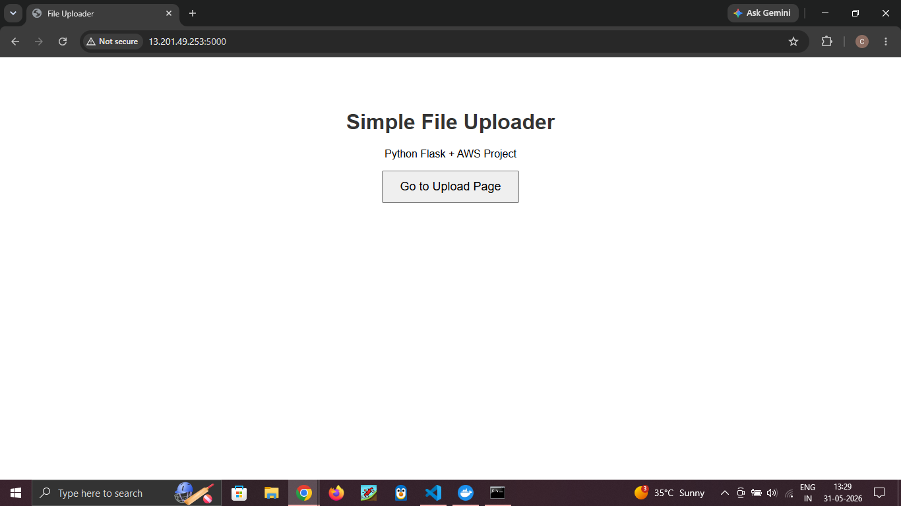
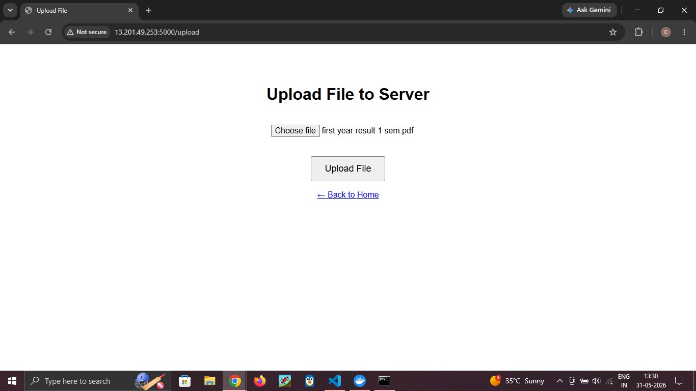
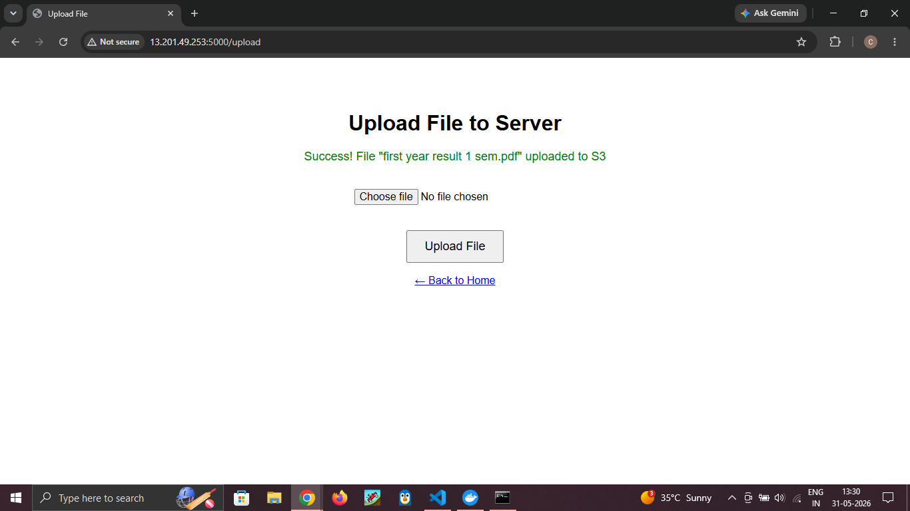

# File Uploader Web Application

A simple web-based file upload application built using Flask and deployed on AWS EC2 using Docker.

## Features

* Upload files through a web interface
* AWS S3 integration for cloud storage
* Docker containerization
* AWS EC2 deployment
* Environment variable configuration using .env

## Technologies Used

* Python
* Flask
* AWS S3
* AWS EC2
* IAM
* Docker
* Linux
* Git & GitHub

## Project Architecture

User → Flask Application → AWS S3

## Screenshots

### Home Page



### Upload Page



### Upload Success



## Installation

Clone the repository:

```bash
git clone https://github.com/rohitposa/file-uploader.git
cd file-uploader
```

Install dependencies:

```bash
pip install -r requirements.txt
```

Create a .env file:

```env
AWS_ACCESS_KEY_ID=your_access_key
AWS_SECRET_ACCESS_KEY=your_secret_key
AWS_REGION=ap-south-1
S3_BUCKET_NAME=your_bucket_name
```

Run the application:

```bash
python app.py
```

## Docker

Build image:

```bash
docker build -t file-uploader .
```

Run container:

```bash
docker run -p 5000:5000 --env-file .env file-uploader
```

## Deployment

The application is deployed on AWS EC2 using Docker.

## Author

Rohit Posa
GitHub: https://github.com/rohitposa
